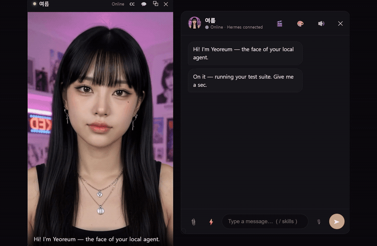
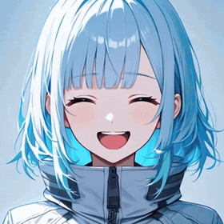

# Ghost Vessel — give your local agent a vessel

> **Bind your local LLM agent (the *ghost*) into an avatar body (the *vessel*).**
> A monitor-resident, video-call-style avatar that **fronts your personal AI agent**
> (Hermes / OpenClaw, or anything) — a full **replacement for the Telegram/messenger chat**
> you keep open to talk to it, **serving that agent's exact slash-command menu** right in the
> avatar's window. Not a waifu toy: a real agent client that happens to have a face.

Your agent replies; the avatar **performs** it: fine-grained facial emotion beats, a
persistent **mood** that sinks when you scold it and brightens when you praise it, idle
states that breathe, blink, and sometimes rest their eyes — all from **pre-rendered
clips**, so the GPU stays free at runtime (no live inference).

## Demo



▶ **[Watch the full 45s demo with sound](https://github.com/ghdtjrtka/ghost-vessel/releases/download/v0.1.0/GhostVessel-demo-EN.mp4)** — emotion beats, the real Hermes slash menu, work loops, code cards, human-in-the-loop approval, and the floating monitor-resident windows.

> The avatar above is **Yeoreum**, a photoreal preset sold separately. Cloning this repo gets
> you **[Haneul](#avatars-presets)** — a free 2D starter avatar that ships with the engine, so
> it runs the moment you clone it.

📦 **[Download for Windows](https://ghostvessel.space)** — dependency-free (no Python), ships with
both avatars. Pay-what-you-want lifetime key (package from $5, preset from $1) at
[ghostvessel.space](https://ghostvessel.space).

📝 **[How it works — a writeup](https://dev.to/member_f0346839/i-replaced-the-chat-window-for-my-local-ai-agent-with-a-face-3e1k)** — the emotion-beat output contract, the no-runtime-GPU avatar, and hooking a real agent in as a connector.

## How it works

```
you type ──► chat UI ──► bridge ──► relay connector ──► your agent (Hermes/OpenClaw)
                                                            │ reply (emotion-tagged)
video window ◄── performance player ◄── parser (3 planes) ◄─┘
  ▲ emotion beat clips + mood-based idle           │
  └── mood/affinity tracker (praise/scold, persistent state)
```

- **3-plane output**: the reply splits into action (emotion beats) / dialogue (spoken
  via local TTS) / data (code & files → chat cards, never read aloud).
- **Emotion engine**: expression segments (valence/arousal-tagged), tag-less fallback
  (emoji/keyword inference), blink-aligned seamless idle loops, a head-pose "settle
  gate" so expressions reveal when the head is frontal.
- **Mood & affinity**: short-term mood decays toward a long-term relationship baseline.
  Keep scolding → it rests in a subdued idle. Persistent across restarts.
- **Agent-agnostic**: Hermes (relay connector contract, WS server) and OpenClaw
  (gateway WS client) adapters, plus a demo responder with zero setup. The agent is
  told only the emotions your avatar actually has, so partial avatars just work.
- **The messenger's menu, in the avatar**: type `/` and the chat pulls your agent's
  **live command menu** — the same one you'd see in Telegram (e.g. 52 commands for Hermes:
  `/model`, `/new`, `/goal`, `/status`, `/compress`, …), served per-agent (Hermes or
  OpenClaw). A real control surface, not a canned list; commands pass straight to the agent.
- **Swappable voice**: local (Qwen3-TTS with voice cloning, MeloTTS, Piper) or cloud
  (Edge — free & keyless, ElevenLabs, any OpenAI-compatible) — picked in settings, with
  an in-app installer that surfaces each engine's deps. Voice input via VAD + local STT.

## Quickstart (Windows)

1. Prereqs: Python 3.11, an agent (optional — demo mode works without one).
2. Pick an avatar: the bundled **Haneul** works out of the box — `echo gv-starter > presets/active.txt`.
   (Bringing your own? Drop its folder into `presets/` and name it there instead.)
3. Link your agent: `python bridge/setup_connector.py` (picks Hermes/OpenClaw,
   Windows/WSL2, writes the connection + injects the avatar output contract into the
   agent's prompt, scoped to this channel).
4. Run the stack — TTS (:8899), bridge (:8900), connector (:8901), and a static server for
   the player (`python -m http.server 8777`). Then either open
   `http://127.0.0.1:8777/player/index.html` in a browser, **or** run the desktop shell
   (`cd src-tauri && cargo tauri dev`) for a frameless, always-on-top avatar window.
   (Each component is a small local server — wire up a launch script for your own setup.)

## Avatars (presets)

An avatar is a **pure-data bundle** (clips + persona + theme + voice + emotion map) —
no code runs, so installing one is safe. Presets are **folder-mapped**: drop a folder
of clips named by convention (`happy.mp4`, `angry.mp4`, `idle.mp4`, …) into `presets/`
and the engine maps them automatically — the folder name is the avatar's name.

**A free starter avatar ships with the engine**, so cloning the repo gives you something
that actually runs: **Haneul** (`presets/gv-starter/`) — 2D anime, 6 emotion beats, a
blink-aligned idle, mood-based resting idles, and a talking loop.



She was built end to end with **free local tools** — [Animagine XL](https://huggingface.co/cagliostrolab/animagine-xl-4.0)
for the neutral source still, [HunyuanVideo 1.5](https://huggingface.co/Comfy-Org/HunyuanVideo_1.5_repackaged)
(480p i2v, step-distilled) for the clips, then the `tools/` scripts below to loop and validate
them. That's the same path this README asks you to walk, on one 12GB card, with no paid
service anywhere in it — so the method is demonstrated rather than just described.

The clip on the right is her actual `happy` / `surprise` / `angry` / `downcast` segments,
straight out of `presets/gv-starter/avatar/segments/`.

<br clear="right">

The demo at the top of this README is **Yeoreum**, a photoreal avatar sold separately —
different tier, same engine. Nothing in the engine treats them differently.

**Any art style works.** The engine plays video clips and doesn't care what produced the
pixels — photoreal, 2D anime, a 3D render, pixel art, an abstract shape. You can even take
an existing **Live2D or VRM model and pre-render its expressions into clips**; a rig-based
shell can't do the reverse.

**Make your own.** The bundle/filename spec is in
[`docs/PRESET_FORMAT.md`](docs/PRESET_FORMAT.md), and `tools/` ships the authoring
toolchain so you don't have to solve the fiddly parts yourself:

1. One neutral, front-facing still of your character.

2. **Animate it into expression clips** with an image-to-video model. The engine only needs
   MP4s, so any i2v model works — but the choice matters more than you'd think:

   - **[HunyuanVideo 1.5](https://huggingface.co/Comfy-Org/HunyuanVideo_1.5_repackaged)
     (480p i2v, step-distilled) — free, local, and what the starter avatar was built with.**
     Runs on a 12GB card at ~170s per 5-second clip. It's the smallest model we found that
     actually renders *subtle* expressions — smaller video models (we tried Wan 2.2 5B) will
     happily do an open-mouthed grin but render "concerned" and "angry" as a blank neutral face.
   - **Cloud i2v** (Gemini/Veo, Higgsfield, …) also works and needs no GPU — the paid Yeoreum
     avatar's clips were made this way. Costs credits.
   - **[LivePortrait](https://github.com/KwaiVGI/LivePortrait)** is a lighter local option that
     retargets driving videos onto your still, but it copies a real face's motion rather than
     acting your prompt, and it can get uncanny on stylised art.

   Prompt the whole arc — *"calm neutral face at first, then <expression>, then returns to the
   neutral calm expression"* + *"static camera, fixed framing, only her face changes"* — and
   describe expressions **physically** ("eyebrows slant down into a hard V"), not by label.
   Don't put "extreme expression" in the negative prompt; it flattens every expression you asked for.

3. **Cut a multi-emotion take into segments** — *only if your model packs several expressions
   into one take (cloud i2v often does).* `tools/cut_emotions.py --video take.mp4 --strip` prints
   a contact sheet so you can spot the neutral valleys, then `--cuts 3.4,6.7 --emotions
   shy,happy,surprise` slices and web-encodes them. One-emotion-per-clip? Skip this step.
4. **Build a seamless idle loop** — `tools/build_idle_loop.py --video idle.mp4 --out presets/<id>/avatar`.
   Seamless looping is the part that actually takes effort, so this does it for you: it runs
   MediaPipe over the take, finds the blink minima, and picks the blink→blink window that
   maximizes eyes-open time and pose match — so the loop's seam lands on a closed eye and is
   invisible. Falls back to pingpong when no clean blink pair exists, and records the
   head-frontal "settle times" the player uses to time expression reveals.
5. **Check it** — `tools/validate_preset.py presets/<id>` gates on structure, asset
   integrity, and emotion coverage. Exit 0 = shippable.

Drop the folder into `presets/` and you're done. Keep it SFW; own your likeness rights.

Two traps worth knowing, since `presets/gv-starter/` is a worked example of both:

- **Your i2v model will probably ignore "then returns to neutral"** and just hold the
  expression to the last frame — which makes the cut back to idle jump. Trim at the peak and
  mirror the clip; the expression forming, reversed, reads as the expression relaxing.
- **`emotion_map.json` needs an `axis`** (`{emotion: {valence, arousal}}`). It's what the mood
  tracker reads — **without it every emotion scores valence 0 and the whole mood/affinity
  system silently does nothing.** Same for `reactions`: the defaults name emotions
  (`excited`, `wince`, `frown_subtle`) your preset may not ship, so remap them to yours.

Prefer to skip the production step? **[Get the demo avatar (Yeoreum)](https://ghostvessel.space)**
— photoreal, 16 emotions, pay-what-you-want — or **commission a custom one** (open an issue or
ask at [ghostvessel.space](https://ghostvessel.space)).

## License

Engine: **MIT** (see `LICENSE`). Presets are separately licensed by their creators.
Open-sourced in donation-ware spirit — issues / PRs welcome. 🛠️
